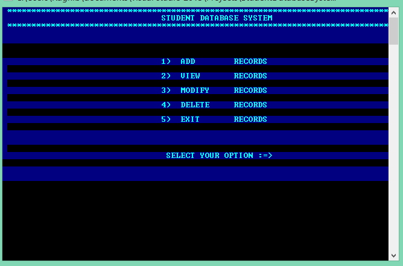

# student-db
> Simple CRUD



## 🚀 Getting Started

1. ``` $ git clone https://github.com/ragmha/student-db.git```

2. Open the file on [Microsoft Visual Studio](https://www.visualstudio.com/vs/) or other < your ♥️ IDE >

3. Compile and Run! 🚀


## License
[MIT](./license) © [Raghib Hasan](http://raghibm.com/)

